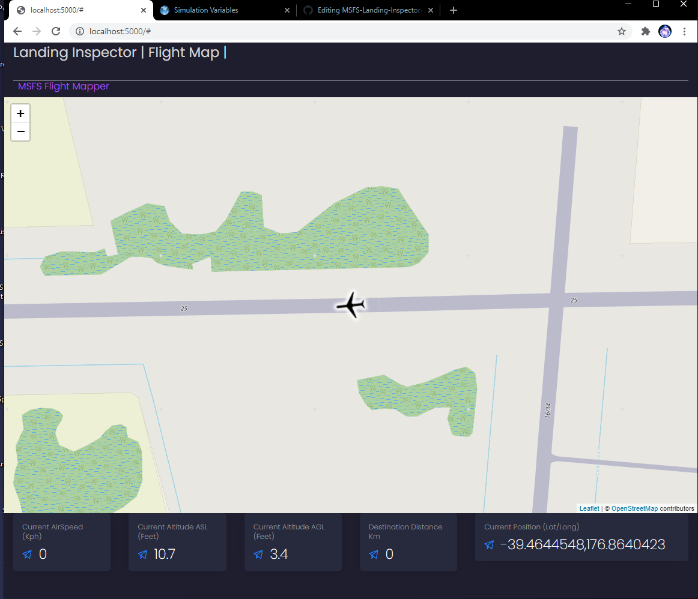

# Sycosys Flight Mapping Fork of MSFS Landing Inspector

# MSFS Landing Inspector + Flight Mapping Tool
MSFS Landing Inspector is a tool for analyzing landings in Microsoft Flight Simulator 2020. It reads the airplane’s telemetry data via SimConnect and displays relevant information about your landing in a web browser. The MSFS Landing Inspector is free to use.

Flight mapping tool is in early development and may have bugs. Access by clicking the flight mapping tab at top of localhost:5000 page. 

## October 3, 2020: Mapping Fork Version 1.1
- **Added Start.bat file to project to start app quickly
- **Split Application into tabs. Landing Inspector and the new Flight Mapper
- **Added Flight Mapping functionality
- **TODO Implement flight track and ability to save flight track ask KML/CSV/etc

## Screenshot of MSFS Flight Mapper in action:

## October 1, 2020: Update Version 1.1:
- **Fixed -999999 values caused by low frame rates.**
- **Fixed vertical speed to represent true values instead of indicated.**
- **Landing rating is now based on the vertical speed at touchdown.**
- **Improved visualization of charts. Different colors are now shown for data when airborne and when on the ground.**

### MSFS Landing Inspector displays the following data:
-	Current vertical G force
-	Current vertical speed
-	Touchdown G force
-	Touchdown vertical speed
-	Graph showing the G forces during landing
-	Graph showing the vertical speed during landing
-	Graph showing the altitude above ground during landing

Screenshot of MSFS Landing Inspector in action:

## Requirements
-	Python 3.7 64-bit or later
-	Python SimConnect library
-	Flask library

## Installation
1. Install the latest Python 3 64-bit Release for Windows. Download the installer from the official [Python website](https://www.python.org/downloads/windows/). Here is a direct link to the [Python 3.8.6 64-bit installer](https://www.python.org/ftp/python/3.8.6/python-3.8.6-amd64.exe). Tick the *Add Python 3.8 to PATH* checkbox when installing Python.
2. Run Command Prompt. Do this by pressing <kbd>Win</kbd> + <kbd>R</kbd>. Type *cmd.exe* and click OK.
3. In the Command Prompt window type *pip install flask* and press <kbd>Enter</kbd>. When asked to download any other Python dependencies, type *y* and press <kbd>Enter</kbd>. This will install the Flask Python library.
4. When finished installing Flask type *pip install SimConnect* and press <kbd>Enter</kbd>. When asked to download any other Python dependencies, type *y* and press <kbd>Enter</kbd>.

## Running MSFS Landing Inspector
1. Start a flight in Microsoft Flight Simulator
2. Download and unzip the MSFS Landing Inspector repository and run *msfs_landing_inspector.py* by double-clicking on it. This should launch a Command Prompt window. Don't close this window.
3. Open your browser and load the site *localhost:5000*. This should load up the MSFS Landing Inspector in your browser.

## Running MSFS Landing Inspector on your mobile device
1. Make sure your PC and your mobile device are connected to the same local network and that your home network is set to *Private* in your Network Profile settings. 
2. Run Command Prompt. Do this by pressing <kbd>Win</kbd> + <kbd>R</kbd>.
3. In the Command Prompt window type *ipconfig* and press <kbd>Enter</kbd>. Look for the line *IPv4 Address* and write down the IP address. In my case, it's *192.168.0.120*. You will most likely have a different IP address. Close the Command Prompt window.
4. Start a flight in Microsoft Flight Simulator
5. Download and unzip the MSFS Landing Inspector repository and run *msfs_landing_inspector.py* by double-clicking on it. This should launch a Command Prompt window. Don't close this window.
6. On your mobile device, load the following site in the browser: *<IP address you've written down>:5000*. In my case, this would be *192.168.0.120:5000*. MSFS Landing Inspector should now load on your mobile device.

## Credits
MSFS Landing Inspector uses the Python [SimConnect](https://pypi.org/project/SimConnect/) library and the CSS theme [Black Dashboard](https://www.creative-tim.com/product/black-dashboard) by [Creative Tim](https://www.creative-tim.com/) for the web front-end.

## Donation
If you like this tool and would like to support the development, please consider donating by clicking on the link below.

Happy landing!
